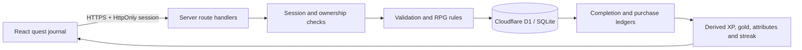

# Questbound architecture

Team TechTitan: Gaurav Vyas (leader), Utkarsh Umang, Shivam Salve.

## Stack

React 19, TypeScript and Next-compatible app routes built with Cloudflare Vinext and Vite. A Cloudflare Worker serves the frontend and API on the same origin. Cloudflare D1 provides managed SQLite persistence. Drizzle owns the schema migrations; runtime queries use prepared D1 statements. No external data provider or paid AI API is needed by the application.

## Data model

- `users`: normalized unique email, display name, salted password hash, account timezone, equipped theme and badge.
- `sessions`: SHA-256 hashes of 256-bit random session tokens, owner, absolute expiration.
- `tasks`: user-owned title, difficulty, attribute, optional due date, creation time, archive flag.
- `completions`: immutable task/title/attribute snapshot and server-calculated rewards. A unique task ID prevents duplicate awards.
- `purchases`: immutable item/price snapshot. Unique `(user_id, item_id)` prevents duplicate debits.
- `rate_limits`: hashed IP/email identifiers and 15-minute authentication attempt windows.

## Security and correctness

The browser cannot directly set XP, gold, attributes, or streaks. Those values are derived from the ledger. A completion is a single atomic `INSERT ... SELECT` from an owned, active task. The server chooses its XP and gold. A purchase checks available balance and inserts the debit within one serialized SQL statement. Retries and concurrent requests cannot mint duplicate rewards or overspend. Completed tasks cannot be edited; archiving retains their completion evidence.

Every personal-data query uses the authenticated user ID from the server session. Task IDs alone provide no authority. Passwords use PBKDF2-SHA256 with a per-account random salt and 100,000 iterations, the Workers Web Crypto iteration ceiling. Session cookies are HttpOnly and SameSite=Lax, with Secure on HTTPS; only token hashes are stored. Writes require a custom header and reject foreign Origins. Passwords, cookies, request bodies, and tokens are never intentionally logged. HTML rendering escapes user-provided text.

The MVP has no email verification or password recovery. The UI never claims that an email is verified. Password hashing is constrained by this runtime; a hardened production identity service would be the next security improvement. Authentication attempts are limited to 30 per IP and email in 15 minutes. This can affect groups sharing an IP and is intentionally documented. No real-world task completion can be independently proved: the app trusts the user to report their effort honestly, while protecting the reward math.

## Progression

Small / steady / brave quests earn 25 / 50 / 100 XP and 10 / 20 / 40 gold. Advancing from level `L` requires `100 × L²` additional XP (100, 400, 900, ...). Attribute levels advance every 100 XP in that category. Streaks count consecutive calendar days in the timezone recorded at signup. Yesterday's streak remains active until today ends. Completion timestamps always come from the server.

## Failure behavior

Mutations remain pending until the server confirms success. Duplicate clicks are disabled in the UI and deduplicated in the database. Network/server failures preserve the task form and show a recoverable message. Expired sessions return 401. Invalid fields return 400, ownership/immutable-state conflicts 409, and unavailable storage 503. There is no fake browser-storage persistence or silent offline success. Tabs refresh state when refocused.

## Design and assets

The Emerald Expanse theme uses original AI-assisted pixel artwork, an emerald journal sidebar, gold reward accents and serif chapter headings. Lucide supplies interface icons. The artwork was generated for this project, converted to WebP, and is committed locally; it has no third-party asset dependency. CSS honors reduced motion. Dialogs use native modal focus containment, labels, keyboard controls and visible focus rings.

## Scale boundaries

This is a hackathon MVP. The API loads each account's history to derive state, and accepts up to 1,000 visible tasks. Large histories would need pagination and transactional aggregate caching. Production cleanup of expired sessions and rate-limit rows is future maintenance work. The cap is a usability limit rather than a security boundary under concurrent task creation. There is no fabricated clinical, customer, or business dataset and no claim of measured real-world productivity gains.
